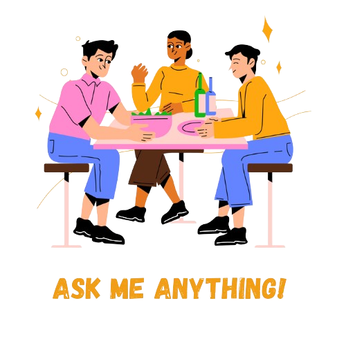

# AMA

    

<h2 align="center">
:sparkles: Ask me anything! :sparkles:  

<a href="https://github.com/sarvsav/ama/issues/new/choose">:speech_balloon: Ask a question</a> &nbsp;&nbsp;&nbsp;&nbsp;&nbsp;&nbsp;&nbsp;&nbsp; <a href="../../issues?q=is%3Aissue+is%3Aclosed+sort%3Aupdated-desc">:book: Read questions</a>
</h2>

<h3>Answering questions via email provides value to only one person. Ask me anything here so everyone can benefit!</h3>

Anything means *anything*. Personal questions. Money. Work. Life. Code. Whatever.

## 👤 About me

I am an aspiring green developer who is passionate about building scalable and maintainable code using Go. I am also a tech writer and have written articles on Medium. I am a strong believer in the power of community and open-source.

In my other time, I am biking, hiking, or reading books.

## 🗓️ Book a 1:1 meeting

If you want to have a 1:1 meeting with me, you can book a slot [here](https://calendly.com/sarvsav/30min).

## 🔔 Get Notified

Subscribe for updates by [watching the repo](https://github.com/sarvsav/ama/subscription).

## 📜 Guidelines

- :mag: Ensure your question hasn't already been answered.
- :memo: Use a succinct title and description.
- :bug: Bugs & feature requests should be opened on the relevant issue tracker.
- :question: Support questions are better asked on Stack Overflow.
- :blush: Be nice, civil and polite.
- :heart_eyes: If you include at least one emoji in your question, the feedback will probably come faster.
- :star: If you are happy with my answer. Please give a star to this repository.

## 📍 Find Me

You can find me on the internet in a few other places.

- [Medium](https://medium.com/@sarvsav)
- [LinkedIn](https://www.linkedin.com/in/sarvsav/)
- [Twitter](https://twitter.com/sarvsav)

## 📁 References

- [Read more AMAs](https://github.com/sindresorhus/amas)
- [What's an AMA?](https://en.wikipedia.org/wiki//r/IAmA)
